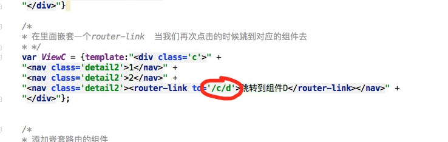

# vue-router实现的多组件切换的简单列子
同级路由以及嵌套路由可以对应进行配置即可
下面是同级路由
``<router-link to="/a">
待付款
</router-link>``
``<router-link to="/b">
待收货
</router-link>``
``<router-link to="/c">
待评价
</router-link>``

嵌套路由
``  var ViewC = {template:"
" +
      "<nav class='detail2'>1</nav>" +
      "<nav class='detail2'>2</nav>" +
      "<nav class='detail2'><router-link to='/c/d'>跳转到组件D</router-link></nav>" +
      "
"};``
      
      
 

